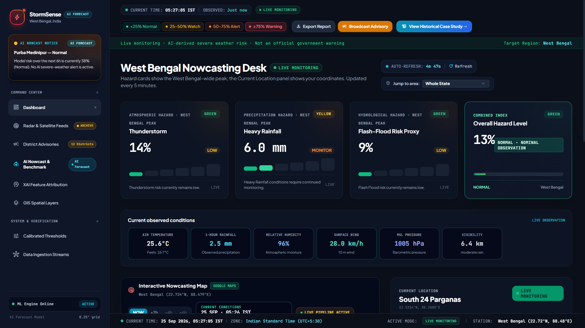
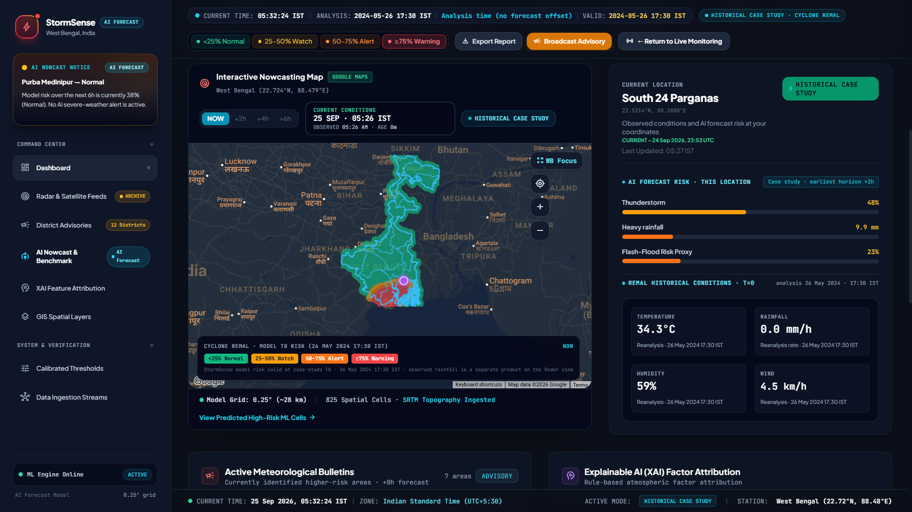
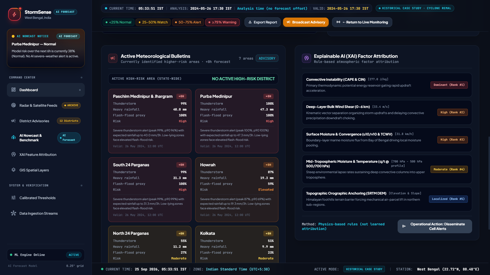
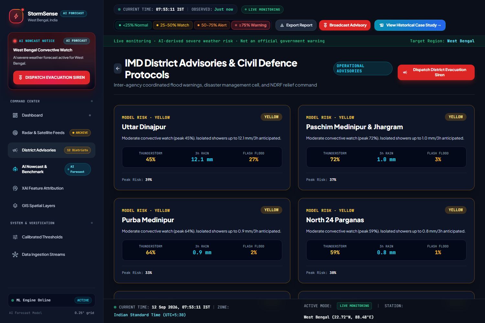
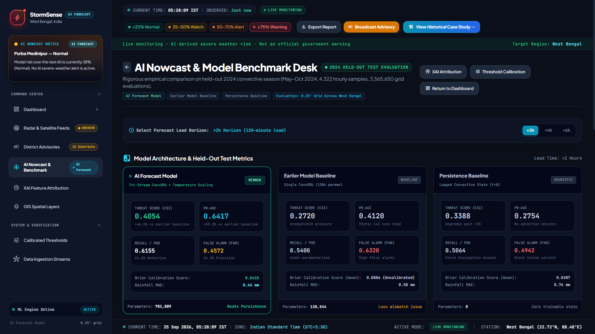
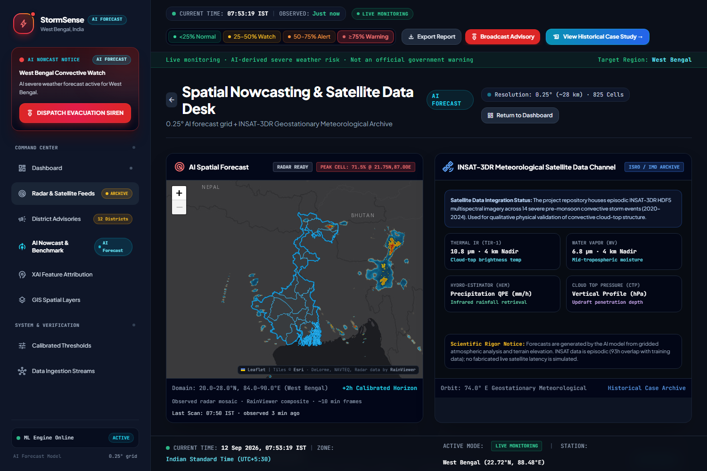
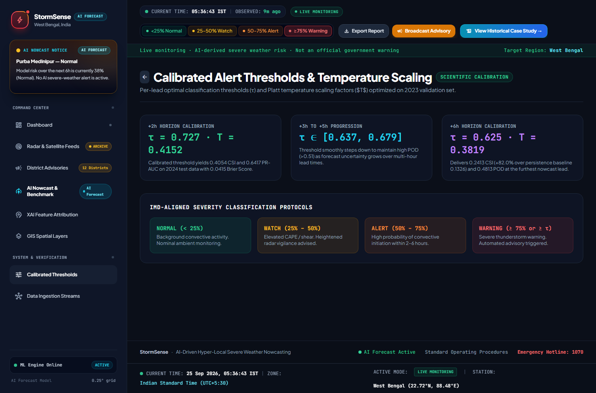
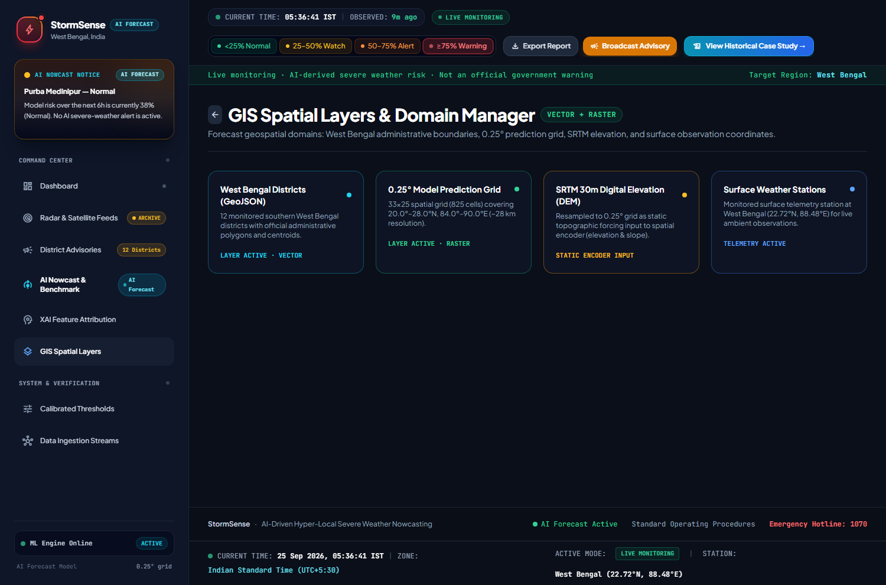
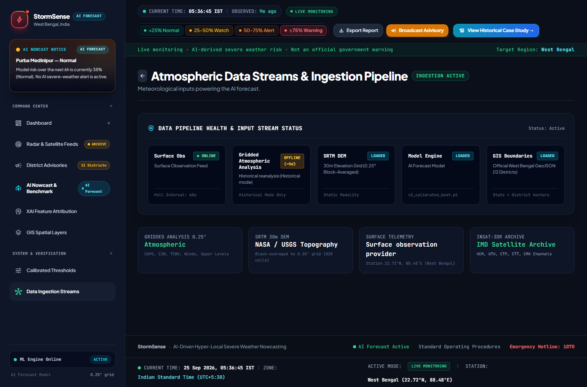
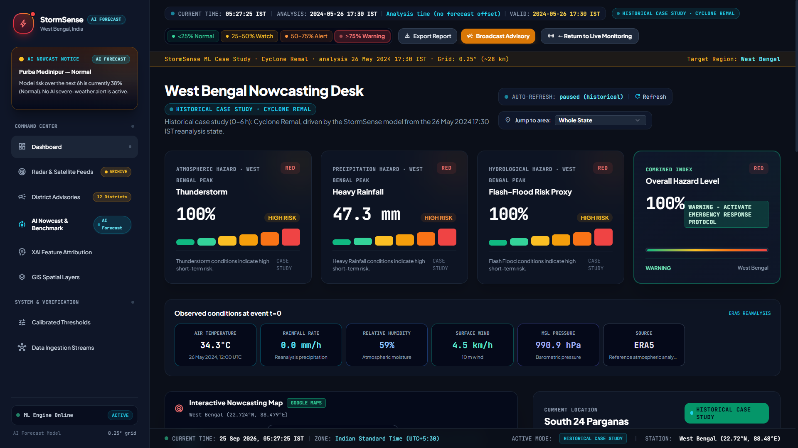

<div align="center">

# 🌩️ StormSense

### AI-driven hyper-local severe-weather early warning and nowcasting system for West Bengal, India.


StormSense forecasts severe convective weather (thunderstorms, heavy rainfall, flash-flood risk) 2–6 hours ahead over a 0.25° grid covering West Bengal.

<br>



</div>

<br>

<div align="center">

**[Overview](#-overview)** · **[Features](#-features)** · **[Tech Stack](#-tech-stack)** · **[Project Structure](#-project-structure)** · **[Installation](#-installation-guide)** · **[Testing](#-testing)** · **[Model & Evaluation](#-model--evaluation-information)** · **[Limitations](#️-limitations)** · **[Security](#-security-notes)**

</div>

---

# 📖 Overview

Short-range, hyper-local severe-weather warning for a monsoon-affected region is a genuine forecasting gap between synoptic-scale numerical weather prediction (which updates every 6 hours and is too coarse) and radar-only nowcasting (which has no forward skill beyond about an hour). 

**StormSense** targets the 2–6 hour range in between, using a small, fast ConvGRU-based deep learning model trained on reanalysis data and run against live operational analyses.

---

# ✨ Features

## 🧠 Advanced Machine Learning
- **Model:** SevereWeatherNetV2 — a tri-stream ConvGRU feeding a shared multi-horizon decoder (781,889 parameters).
- **Outputs:** Severe-weather probability, 3-hour rainfall (mm), and a derived flash-flood risk proxy.
- **Lead Times:** +2h, +3h, +4h, +5h, +6h native model leads.
- **Live inference:** Fetches the newest available NOAA GFS analysis, harmonizes it onto the model's grid, and runs real inference — this is the primary mode the dashboard runs in.
- **Calibration:** Per-lead Platt temperature scaling and optimal classification thresholds (τ), fit on a held-out 2023 validation set.

## 📊 Dashboard Views

The dashboard is organized into 8 views, grouped as **Command Center** (the operational picture) and **System & Verification** (the pipeline and model evidence behind it):

| View | What it shows |
|---|---|
| **Dashboard** | The main operational picture: 4 hazard KPI cards (thunderstorm, heavy rainfall, flash-flood proxy, combined index), the interactive risk map with NOW/+2h/+4h/+6h horizons, current observed conditions, and the current-location panel bound to the viewer's own coordinates. |
| **Radar & Satellite Feeds** | Live RainViewer radar mosaic over West Bengal + neighbouring states, alongside the INSAT-3DR geostationary satellite data channel (thermal IR, water vapor, precipitation QPE, cloud-top pressure). |
| **District Advisories** | Per-district civil-defence cards (all 12 monitored districts) with thunderstorm/rainfall/flash-flood percentages, peak risk, and the operator's "Dispatch District Evacuation Siren" action. |
| **AI Nowcast & Benchmark** | Rigorous model comparison on the held-out 2024 test set: the production model vs. an earlier baseline vs. a persistence heuristic, across CSI, PR-AUC, POD, FAR, Brier score, and rainfall MAE. |
| **XAI Feature Attribution** | Rule-based (physics-inspired, not gradient-based) attribution ranking which atmospheric factors — CAPE/CIN, wind shear, moisture convergence, mid-tropospheric humidity, orographic lift — drove the current forecast. |
| **GIS Spatial Layers** | The forecast's geospatial domain manager: West Bengal district boundaries (GeoJSON), the 0.25° / 825-cell prediction grid, the SRTM 30m elevation input, and live surface station coordinates. |
| **Calibrated Thresholds** | The per-lead calibration math itself: τ and temperature-scaling factor T at each horizon, and the IMD-aligned Normal/Watch/Alert/Warning severity bands they define. |
| **Data Ingestion Streams** | Live pipeline health for every input feed (surface observations, gridded atmospheric analysis, SRTM DEM, model engine, GIS boundaries) with online/offline status and poll intervals. |

<br>

<table>
<tr>
<td width="50%"></td>
<td width="50%"></td>
</tr>
<tr>
<td align="center"><sub>Interactive map + current-location AI forecast risk</sub></td>
<td align="center"><sub>Active bulletins & XAI factor attribution</sub></td>
</tr>
<tr>
<td width="50%"></td>
<td width="50%"></td>
</tr>
<tr>
<td align="center"><sub>District advisories & civil defence protocols</sub></td>
<td align="center"><sub>Model benchmark: AI forecast vs. earlier baseline vs. persistence</sub></td>
</tr>
<tr>
<td width="50%"></td>
<td width="50%"></td>
</tr>
<tr>
<td align="center"><sub>Radar & INSAT-3DR satellite data desk</sub></td>
<td align="center"><sub>Calibrated alert thresholds & temperature scaling</sub></td>
</tr>
<tr>
<td width="50%"></td>
<td width="50%"></td>
</tr>
<tr>
<td align="center"><sub>GIS spatial layers & domain manager</sub></td>
<td align="center"><sub>Data ingestion pipeline health</sub></td>
</tr>
</table>

## 🕰️ Historical Case Study (secondary)
A frozen replay of Cyclone Remal (26 May 2024), using the model's real ERA5-input test-time forecast for that event. Its purpose: when live weather over West Bengal happens to be calm at demo time, this lets you show the model actually detecting a genuine severe-weather event from past data, rather than only an uneventful live feed.

<p align="center"></p>

---

# 🛠 Tech Stack

| Category | Technology |
|----------|------------|
| Language | Python 3.11+, JavaScript |
| Frontend | Vanilla JS, Tailwind CSS, Google Maps API, Leaflet |
| Backend | FastAPI, Uvicorn |
| Machine Learning | PyTorch |
| Geospatial & Data | xarray, cfgrib, h5py, Shapely, GeoPandas |
| Architecture | Split or Merged-mode client/server |

---

# 📂 Project Structure

```text
StormSense/
├── backend/                 # FastAPI app: routes, OpenWeather client, config
├── configs/                 # default.yaml (production V2) + candidate configs
├── Data/
│   ├── BOUNDARIES/          # West Bengal state & district GeoJSON
│   ├── outputs/             # Production + fallback model checkpoints
│   └── INSAT/               # Satellite archive (not committed; see setup)
├── docs/
│   └── manual/              # Generated reference docs (.docx/.pdf)
├── frontend/
│   ├── static/screenshots/  # Dashboard screenshots used in this README
│   └── ...                  # Dashboard client (index.html, js/, css/)
├── processed/
│   └── cache/               # Preprocessed ERA5/DEM and live GFS cache
├── scripts/                 # Training, evaluation, and backtest tooling
├── src/
│   ├── api/                 # Legacy FastAPI app
│   ├── data/                # Dataset loaders, preprocessing
│   ├── features/            # Normalization, target construction
│   ├── inference/           # Live inference, GFS/INSAT pipelines
│   ├── models/              # SevereWeatherNetV2 architectures
│   └── training/            # Losses, metrics, calibration
├── tests/                   # Unit, API, and Playwright browser tests
├── .env.example
├── landing.html
├── LICENSE
├── README.md
├── requirements.txt
├── run_backend.py
├── run_frontend.py
└── run_server.py
```

---

# 🚀 Installation Guide

## Prerequisites

- Python 3.11+
- Git and **Git LFS** (Required for checkpoints & cache)
- ~3 GB free disk space
- OpenWeatherMap API Key
- Google Maps JavaScript API Key

---

## Step 1 : Clone the Repository

```bash
git clone https://github.com/Souvik686/StormSense.git
cd StormSense
git lfs pull
```

---

## Step 2 : Setup Virtual Environment

```bash
python -m venv venv
venv\Scripts\activate              # Windows
# source venv/bin/activate         # macOS/Linux
```

---

## Step 3 : Install Dependencies

```bash
pip install --upgrade pip
pip install -r requirements.txt
```

---

## Step 4 : Configure Environment

```bash
cp .env.example .env
```
Edit .env and fill in:
- OPENWEATHER_API_KEY
- GOOGLE_MAPS_API_KEY *(Secure this in Google Cloud Console via HTTP referrers!)*

---

## Step 5 : Run the Server

```bash
python run_server.py
```

This serves both the dashboard and the API from a single process on port 8000. To run them as two separate processes instead (useful for independent frontend/backend development):

```bash
python run_backend.py     # API on :8000
python run_frontend.py    # dashboard on :3000, calling the API cross-origin
```

---

## Step 6 : Open the Dashboard

- Landing page: http://127.0.0.1:8000/
- Dashboard: http://127.0.0.1:8000/dashboard
- API Docs: http://127.0.0.1:8000/docs

---

# 🧪 Testing

To run the unit and integration tests:

```bash
pytest tests/ -q
```
*(Browser tests require Chromium: playwright install chromium)*

---

# 📉 Model & Evaluation Information

Three distinct evaluation contexts exist in this repository:

1. **Held-out benchmark:** V2 evaluated on a chronologically-split 2024 test set (ERA5 input). At +2h: CSI 0.4054, beating persistence by +19.7%.
2. **GFS production backtest:** V2 run against live-style GFS analyses. At +2h: CSI 0.049. *(Live skill is materially lower than benchmark due to distribution shift).*
3. **Live inference:** Real-time production output against current GFS analyses.

---

# ⚠️ Limitations

- **Live skill is lower than benchmark figures** due to ERA5 vs GFS distribution shift.
- **Proxy Labels:** The severe-weather label reflects convective-support environments, not guaranteed observed events.
- **Resolution:** 0.25° (~28 km) native grid, visually interpolated on the map.
- **XAI is rule-based** physics-inspired attribution, not gradient saliency or SHAP.

---

# 🔒 Security Notes

- **Never commit real credentials.** Use the .env file safely.
- Any API keys present in older commits of this repository prior to cleanup should be considered compromised and rotated immediately.

---

# 👨‍💻 Author

## Souvik Sarkar

GitHub: https://github.com/Souvik686

---

<div align="center">

### ⭐ If you found this project useful, please consider giving it a Star!

Made with ❤️ using Python, FastAPI & PyTorch

</div>
